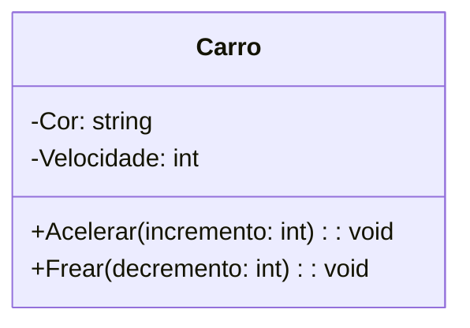
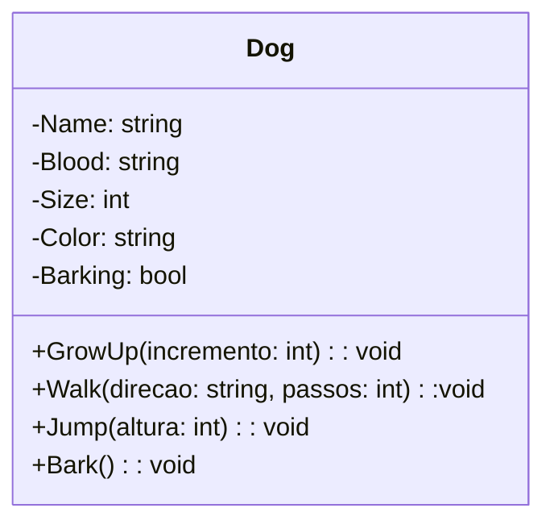
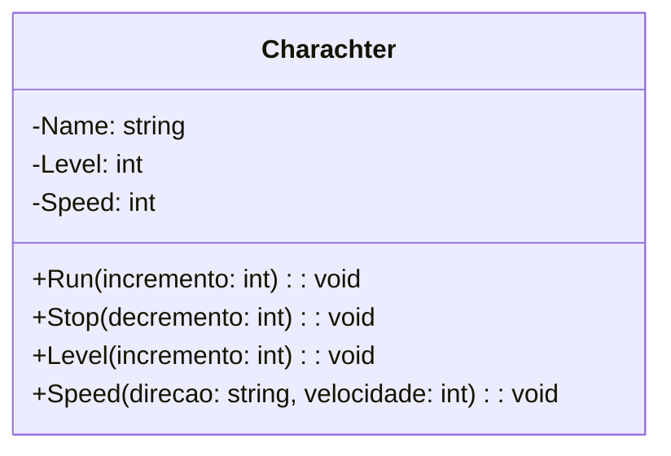
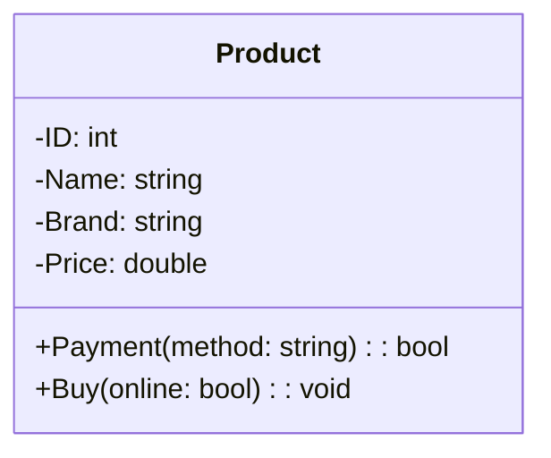
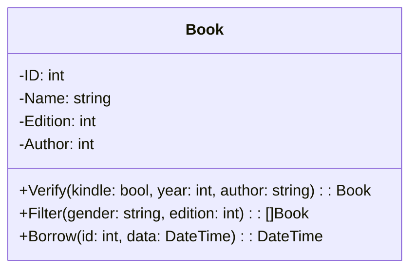
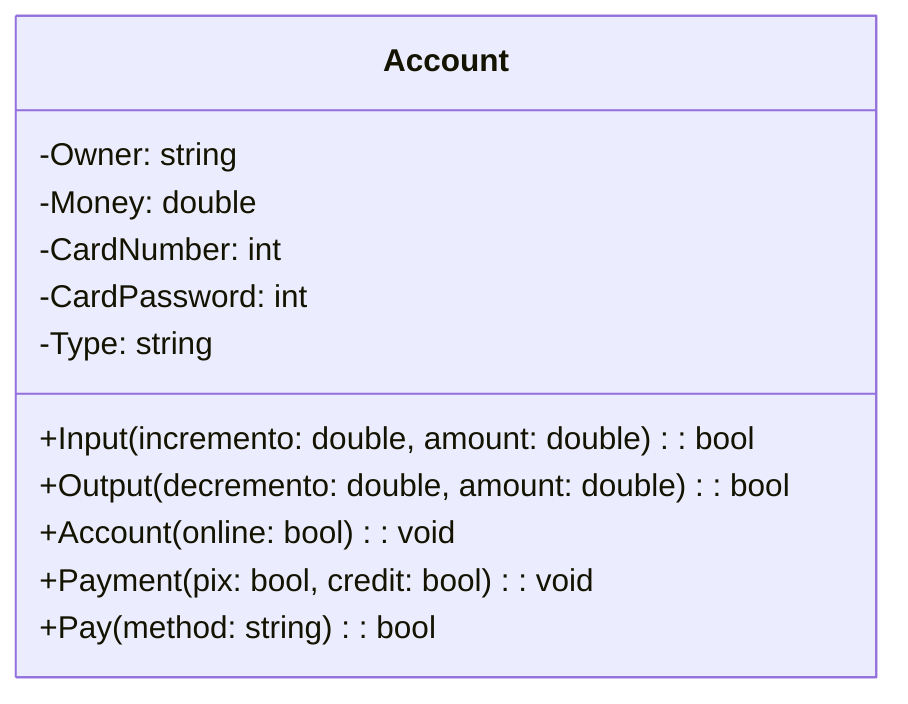
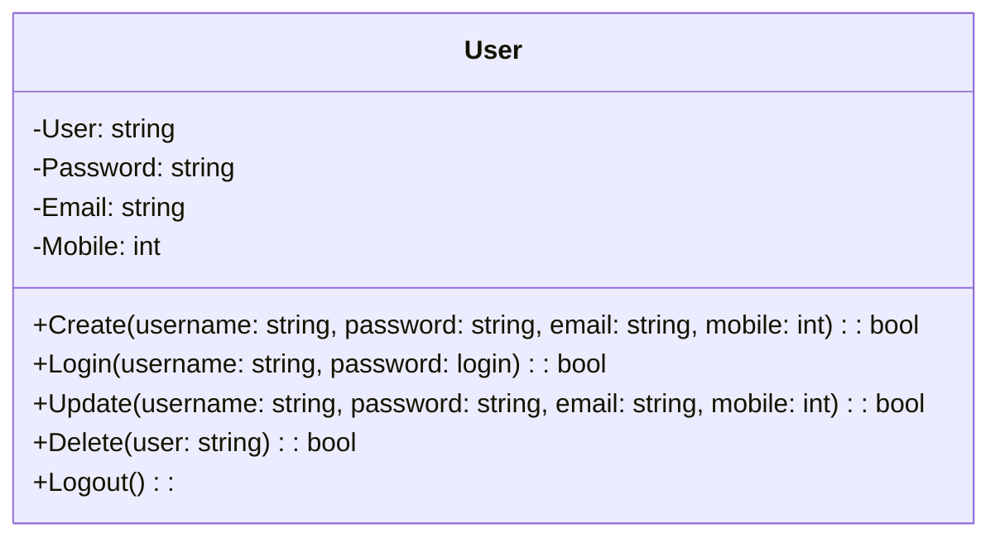
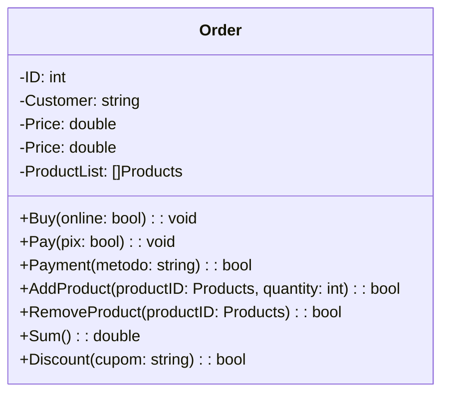
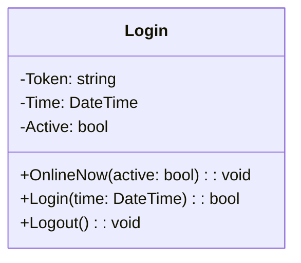
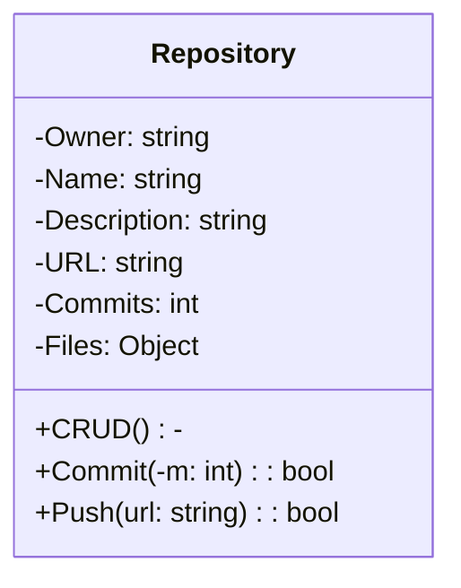

# Exercícios de aula 01: POO + UML (parte 1)

Profº.: Cainã Antunes Silva  
Faculdade de Tecnologia **SENAI Sorocaba**  
Tecnólogo em Análise e Desenvolvimento de Sistemas (ADS)
___

> O objetivo desta aula é exercitar a habilidade de abstrair objetos em classes utilizando-se notações em UML.  

O paradigma de desenvolvimento de software intitulado Programação Orientada à Objetos é uma ferramenta poderosa que auxilia na construção de sistemas complexos. A abstração é um recurso indispensável para programadores que almejam dominar esta poderosa técnica de programação. Além disso o uso de diagramas UML é indispensavel para representar estas abstrações e guiar os desenvolvidores na hora da implementação.

Para mais informações acesse [Aula 01: Paradigma POO.](https://cainaantunes.notion.site/Aula-01-Paradigma-POO-23fbde521b3b80149a11f08e9d1eac02?source=copy_link)

***

1. **Carro:** 
Pense em um carro do cotidiano. Como ele pode ser descrito em termos de informação e comportamento?
Crie um diagrama de classe UML que represente essa entidade.

   

2. **Cachorro:** 
Um cachorro de estimação pode ser identificado de várias formas e interagir com o ambiente.  
Represente essa ideia por meio de uma classe UML com atributos e métodos que façam sentido.

3. **Jogador de Videogame:** 
Considere um personagem controlado por um jogador em um jogo eletrônico. Quais informações podem ser armazenadas sobre ele? Que ações ele pode realizar? 
Modele uma classe que represente esse jogador.

4. **Produto de Loja:** 
Imagine um produto exposto em uma loja, seja física ou virtual. Quais dados são importantes para representá-lo? Que tipo de operações podem ser feitas sobre ele? 
Crie uma classe UML com base nessas reflexões.

5. **Livro:** 
Pense em como você descreveria um livro para um sistema digital (como uma biblioteca ou livraria online).
Quais dados o sistema precisaria guardar sobre esse livro? Que ações poderiam ser realizadas com ele?

[]Book retorna a uma lista || DateTime é usado para retornar data e hora

6. **Conta Bancária:** 
Considere como um sistema bancário representa uma conta de um cliente. Quais dados são essenciais? Que operações a conta deve suportar? 
Modele isso como uma classe UML.

7. **Usuário de Sistema:** 
Um sistema informatizado permite que pessoas se cadastrem, acessem recursos e atualizem suas informações. 
Crie uma classe que represente esse "usuário" de forma genérica, com seus atributos e comportamentos.

8. **Pedido de Compra:** 
Em um sistema de compras online ou presencial, como um pedido de compra pode ser estruturado em uma classe? 
Pense em quais informações estão envolvidas em um pedido e quais ações podem ser realizadas com ele.

[]Products retorna a uma lista que já contém infromações armazenamdas, por isso só precisa do peoductID no +AddProduct

9. **Sessão de Login:** 
Quando um usuário entra em um sistema, uma sessão é iniciada. Como essa sessão poderia ser representada em uma classe? 
Reflita sobre os dados e comportamentos necessários para modelar esse conceito.

DateTime é usado para retornar data e hora

10. **Repositório Git:** 
Pense em como um sistema como o GitHub representa um repositório de código. Quais dados ele precisa manter? Que ações podem ser realizadas sobre ele? 
Modele esse objeto como uma classe UML.

Object aceita quaisquer classes dentro dela || CRUD: create, read, update, delete